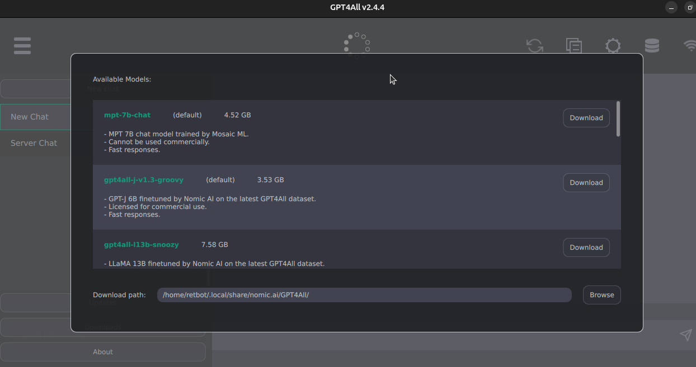

# Instalación de gpt4all para Linux Ubuntu

En este documento se describe cómo instalar y configurar gpt4all en Linux Ubuntu. También se proporcionan ejemplos de código para realizar solicitudes utilizando la interfaz de chat GPT4All Chat UI y la API de Python de GPT4All.


## Instalación

Sigue estos pasos para instalar gpt4all en Ubuntu:

1. Abre tu navegador web y visita la página oficial de [GPT4ALL](https://gpt4all.io/index.html).
   

2. Descarga el instalador para Ubuntu desde la página web.
   

3. Una vez finalizada la descarga, tendrás un archivo llamado `gpt4all-installer-linux.run`.
   

4. Haz clic derecho en el archivo descargado y selecciona "Propiedades" o presiona "Alt + Intro".
   

5. En la ventana de propiedades, marca la opción "Permitir ejecutar el archivo como un programa".
   

6. Abre una terminal desde la carpeta donde se encuentra el archivo descargado. Puedes hacerlo haciendo clic derecho en la carpeta y seleccionando "Abrir en una terminal".
   

7. Instala la aplicación ejecutando el siguiente comando en la terminal:
Esto iniciará el instalador de la aplicación.
   

    ```bash
    ./gpt4all-installer-linux.run
    ```

8. En la pantalla de configuración inicial, selecciona "Siguiente".
   

9. Elige la carpeta de instalación y haz clic en "Siguiente".
   

10. Selecciona el componente "gpt4all".
   

11. Acepta la licencia y haz clic en "Siguiente".
   
   

12. Haz clic en "Instalar".
   

    Nota: Si aparece un error durante la instalación, selecciona "Ignorar". <br>
    Este error ocurre debido a la falta de configuración del icono de inicio en Ubuntu.
   

13. Haz clic en "Finalizar" para completar la instalación.
   

    Nota 2: La aplicación se encuentra en la ubicación donde se realizó la instalación en el paso 9. En mi caso, se encuentra en home/user/gpt4all. <br>
    La aplicación está dentro de la carpeta bin/.
   
    El nombre del archivo ejecutable es chat.
   
    Recuerda esta ubicación para crear el icono de inicio.

### Icono en el inicio de Ubuntu

Sigue estos pasos para agregar un icono en el inicio de Ubuntu:

1. Haz clic en las tres líneas en la esquina superior derecha del administrador de archivos.
   

2. Selecciona "Mostrar archivos ocultos" o presiona "Ctrl + H".
   

3. Aparecerán los archivos ocultos y entra en la carpeta ".local".
   

4. Dentro de la carpeta "local", entra en "share".
   

5. Luego, entra en la carpeta "applications".
   

6. Crea un archivo llamado "GPT4All.desktop" dentro de la carpeta "applications". Asegúrate de agregar la extensión ".desktop" al final del nombre para que sea reconocido por el sistema.
   

7. Abre el archivo "GPT4All.desktop" y agrega el siguiente contenido:
Nota: Asegúrate de ajustar la ruta de acuerdo a la ubicación de tu instalación de gpt4all.
   

    ```text
    [Desktop Entry]
    Type=Application
    Categories=Utility
    Name=Gpt4all
    Icon=/home/user/gpt4all/logo-32.png
    Exec=/home/user/gpt4all/bin/chat
    ```

8. Reinicia el entorno gráfico de GNOME para que el icono aparezca:
Nota: Si no funciona, reinicia el sistema por completo.
    

   ```bash
    gnome-shell --replace &
   ```

9. Si todo ha salido bien, el icono de gpt4all debería aparecer en el inicio. 
   

## Configuración GPT4All Chat UI

Sigue estos pasos para configurar gpt4all en Ubuntu:

1. Haz clic en la aplicación para abrirla.
   

2. La aplicación mostrará los modelos disponibles. Selecciona el que más te guste. Recuerda que puedes cambiarlo más tarde.
   

3. En mi caso, seleccioné "vicuna-13b-1.1-q4_2" y "vicuna-7b-1.1-q4_2".
   

4. A continuación, se abrirá un entorno similar a ChatGPT, donde puedes escribir tus preguntas y la IA responderá utilizando los recursos de tu PC.
   

5. Si deseas actualizar o descargar modelos adicionales, haz clic en las tres barras diagonales para mostrar los botones correspondientes.
   
   

6. En nuestro caso, selecciona el icono de engranaje ("opciones").
   

7. En "Application", activa el servidor web "Enable web server".
   
   

8. Ten en cuenta que esta opción consume una cantidad considerable de memoria RAM.

## Configuración del servidor con Python

Sigue estos pasos para configurar el servidor:

1. Verifica si tienes instalado Python 3 y pip ejecutando los siguientes comandos:
   

   ```bash
   python3 --version
   pip --version
   ```

2. Si no están instalados, ejecuta el siguiente comando para instalar Python 3 y pip: 
   

   ```bash
    sudo apt install python3 python3-pip
   ```

3. Luego, instala virtualenv para crear un entorno virtual donde se ejecutará el servidor: 
   

   ```bash
    sudo apt install virtualenv
   ```

4. Crea el entorno virtual utilizando el siguiente comando. Puedes elegir el nombre que desees para el entorno, en este caso lo llamaremos "server":
   

   ```bash
    virtualenv server
   ```

   
   
   ```bash
     source server/bin/activate
   ```

5. Para salir del entorno virtual, utiliza el siguiente comando:
   
   ```bash
    deactivate
   ```

   Para volver a entrar al entorno virtual, utiliza el siguiente comando:
   
   ```bash
    source nombre_del_entorno/bin/activate
   ```

## Server con GPT4All Chat UI

Teniendo GPT4All abierto y con el entorno virtual activado, sigue estos pasos para crear un servidor:

1. Instala openai ejecutando el siguiente comando:
   

   ```bash
   pip install openai
   ```

   

2. Consulta básica:
    2.1. Crea un archivo llamado [BasicChat.py](https://github.com/RETBOT/ChatDynamix/blob/main/Linux/code/BasicChat.py) y coloca el siguiente código: 
       

       ```python
       import openai

       openai.api_base = "http://localhost:4891/v1"
       #openai.api_base = "https://api.openai.com/v1"

       openai.api_key = "not needed for a local LLM"

       # Set up the prompt and other parameters for the API request
       prompt = "Hi"
       print(prompt)

       # Models
       # model = "gpt-3.5-turbo"
       #model = "mpt-7b-chat"
       #model = "gpt4all-j-v1.3-groovy"
       model = "vicuna-7b-1.1-q4_2"

       # Make the API request
       response = openai.Completion.create(
           model=model,
           prompt=prompt,
           max_tokens=400,
           temperature=0.7,
           top_p=0.95,
           n=1,
           echo=True,
           stream=False
       )

       # Print the generated completion
       print(response)
       ```

    2.2. y lo ejecutaremos con el siguiente comando:
       
       
       ```bash
       python BasicChat.py
       ```

    2.3. y dara como resultado la siguiente consulta: 
       

3. Consulta Avanzada utilizando postman: 
    3.1. Crearemos un archivo llamado [Server.py](https://github.com/RETBOT/ChatDynamix/blob/main/Linux/code/Server.py), El cual contendra el siguiente codigo:
       python Server.py
       

       ```python
       from flask import Flask, request
       import gpt4all

       app = Flask(__name__)

       # Global variable to store the initial prompt
       prompt = "Hi"

       # Global variable to store the library, loaded at startup
       lib = "ggml-gpt4all-j-v1.3-groovy"
       gptj = gpt4all.GPT4All(lib)

       # Route to display the current prompt
       @app.route('/')
       def index():
           # Displays the current prompt.
           return prompt

       # Route to install the library
       @app.route('/install')
       def install():
           # Installs the library ggml-gpt4all-j-v1.3-groovy.
           global gptj
           gptj = gpt4all.GPT4All("ggml-gpt4all-j-v1.3-groovy")
           return 'Library installed: ggml-gpt4all-j-v1.3-groovy'


       # Route to install a new library
       @app.route('/install', methods=['POST'])
       def install_post():
           # Installs a new library specified in the request form.
           global lib
           global gptj

           lib = request.form['lib']
           gptj = gpt4all.GPT4All(lib)
           return 'Library installed: ' + lib

       # Route to receive a value via HTTP and update the prompt
       @app.route('/update-prompt', methods=['POST'])
       def update_prompt():
           # Updates the prompt with the value specified in the request form.
           global prompt
           prompt = request.form['value']
           return 'Prompt updated: ' + prompt

       # Route to generate a response using the updated prompt
       @app.route('/chat', methods=['POST'])
       def generate_response():
           # Generates a response using the updated prompt.
           global prompt
           global gptj

           prompt = request.form['value']
           messages = [{"role": "assistant", "content": "As an experienced AI assistant, I'll help you with programming questions and provide code solutions in your preferred language. Your name is ChatDynamix"}, {"role": "user", "content": prompt}]
           response = gptj.chat_completion(messages)
           return response

       if __name__ == '__main__':
           app.run()
       ```

    3.2. y lo ejecutaremos con el siguiente comando:
       

       ```bash
       python Server.py
       ```

    3.3. utilizando postman seleccionamremos una consulta GET:
        a la url: http://localhost:5000 o a la que le generer el paso anterior
        y dara como resultado la siguiente consulta: 
       
       que en este caso es el valor que tiene por default el mensaje
    
    3.4. para utilizar el chat seleccionaremos una consulta POST: 
        a la url: http://localhost:5000 o a la que le generer el paso anterior
        en el body, seleccionamos form-data y agregaremos un nuevo valor llamado "value" y el contenido
        es el mensaje a enviar, en este caso es "Hi" y el resultado sera la respuesta generada por gpt4all
        

Para mas informacion entrar a [GPT4All Chat UI Documentation](https://docs.gpt4all.io/gpt4all_chat.html)

## Server con GPT4All Python API

Teniendo el entorno virtual activado, sigue estos pasos para crear un servidor:

1. Instala gpt4all desde la terminal ejecutando el siguiente comando:
   

   ```bash
   pip install gpt4all
   ```

2. Crea un archivo llamado [Server2.py](https://github.com/RETBOT/ChatDynamix/blob/main/Linux/code/Server2.py) y coloca el siguiente código: 

   ```python
   from flask import Flask, request
   import gpt4all

   app = Flask(__name__)

   # Global variable to store the initial prompt
   prompt = "Hi"

   # Global variable to store the library
   lib = "ggml-gpt4all-j-v1.3-groovy"

   # Main route to display the current prompt
   @app.route('/')
   def index():
       return prompt

   # Route to install the library
   @app.route('/install')
   def install():
       gptj = gpt4all.GPT4All("ggml-gpt4all-j-v1.3-groovy")
       return 'Library installed: ggml-gpt4all-j-v1.3-groovy'

   # Route to install the library via POST request
   @app.route('/install', methods=['POST'])
   def install_post():
       global lib

       lib = request.form['lib']
       gptj = gpt4all.GPT4All(lib)
       return 'Library installed: ' + lib

   # Route to receive the value via HTTP and update the prompt
   @app.route('/update-prompt', methods=['POST'])
   def update_prompt():
       global prompt
       prompt = request.form['value']
       return 'Prompt updated: ' + prompt

   # Route to generate the response using the updated prompt
   @app.route('/chat', methods=['POST'])
   def generate_response():
       global prompt
       global lib

       prompt = request.form['value']
       gptj = gpt4all.GPT4All(lib)
       messages = [{"role": "user", "content": prompt}]
       return str(gptj.chat_completion(messages))

   if __name__ == '__main__':
       app.run()
   ```

3. Ejecuta el archivo Server2.py con el siguiente comando:
    
    
    ```bash
    python Server2.py
    ```

4. Instala una biblioteca en el servidor:
    - Si deseas instalar una biblioteca por defecto, realiza una solicitud GET a la URL http://localhost:5000/install utilizando Postman.
    - Si deseas instalar una biblioteca diferente, consulta la página oficial de GPT4All para obtener una lista de bibliotecas disponibles. Luego, realiza una solicitud POST a la misma URL (http://localhost:5000/install) utilizando Postman. En el cuerpo de la solicitud, selecciona "form-data" y agrega un nuevo campo llamado "lib" con el nombre de la biblioteca que deseas instalar.
    
   
   
5. Espera a que se complete la instalación de la biblioteca. Este proceso solo es necesario la primera vez que instalas una biblioteca nueva.
   

6. Una vez instalada la biblioteca, puedes realizar solicitudes de chat. Abre una nueva pestaña en Postman, 
    selecciona el método POST y utiliza la URL http://localhost:5000/chat. En el cuerpo de la solicitud, selecciona "form-data" y agrega un nuevo campo llamado "value" con el mensaje que deseas enviar. Por ejemplo, utiliza "Hi". Obtendrás la respuesta generada por GPT4All.
   

7. También puedes ver el mensaje en la terminal donde se está ejecutando el servidor:
   

Para mas informacion entrar a [GPT4All Python API Documentation](https://docs.gpt4all.io/gpt4all_python.html)
