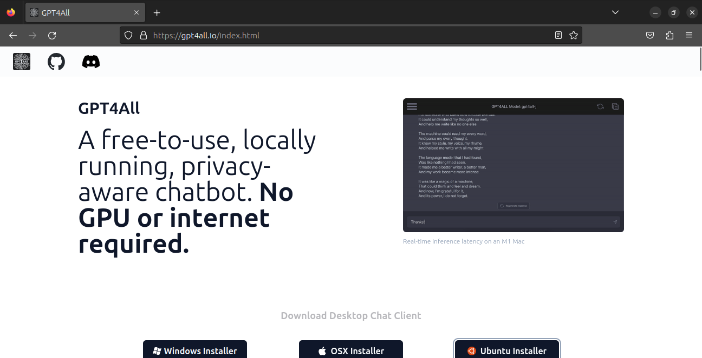
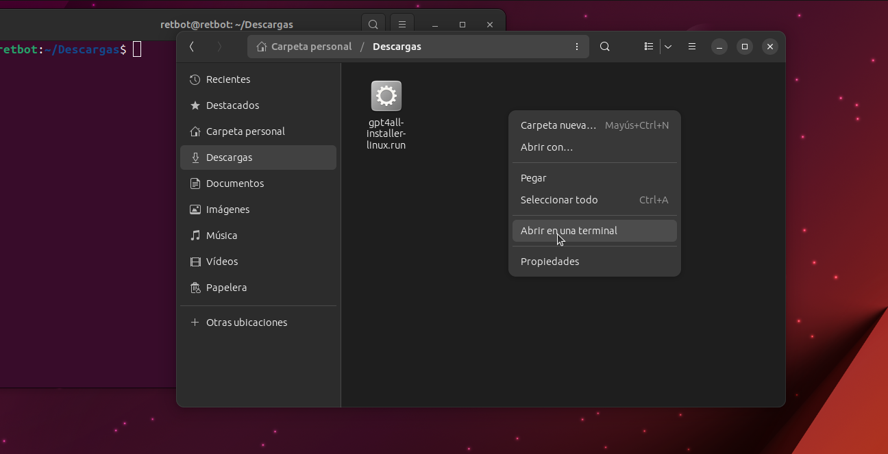
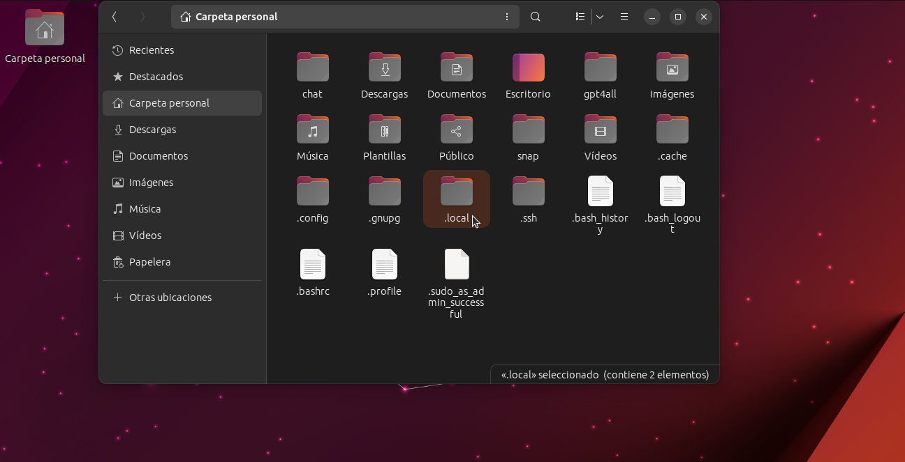

# Instalación de gpt4all para Linux Ubuntu

En este documento se describe cómo instalar y configurar gpt4all en Linux Ubuntu. También se proporcionan ejemplos de código para realizar solicitudes utilizando la interfaz de chat GPT4All Chat UI y la API de Python de GPT4All.

## Instalación

Sigue estos pasos para instalar gpt4all en Ubuntu:

1. Abre tu navegador web y visita la página oficial de [GPT4ALL](https://gpt4all.io/index.html).


2. Descarga el instalador para Ubuntu desde la página web.


3. Una vez finalizada la descarga, tendrás un archivo llamado `gpt4all-installer-linux.run`.


4. Haz clic derecho en el archivo descargado y selecciona "Propiedades" o presiona "Alt + Intro".


5. En la ventana de propiedades, marca la opción "Permitir ejecutar el archivo como un programa".


6. Abre una terminal desde la carpeta donde se encuentra el archivo descargado. Puedes hacerlo haciendo clic derecho en la carpeta y seleccionando "Abrir en una terminal".


7. Instala la aplicación ejecutando el siguiente comando en la terminal:
```bash
 ./gpt4all-installer-linux.run
```
Esto iniciará el instalador de la aplicación.


8. En la pantalla de configuración inicial, selecciona "Siguiente".


9. Elige la carpeta de instalación y haz clic en "Siguiente".


10. Selecciona el componente "gpt4all".


11. Acepta la licencia y haz clic en "Siguiente".


12. Haz clic en "Instalar".


Nota: Si aparece un error durante la instalación, selecciona "Ignorar". <br>
Este error ocurre debido a la falta de configuración del icono de inicio en Ubuntu.


13. Haz clic en "Finalizar" para completar la instalación.


Nota 2: La aplicación se encuentra en la ubicación donde se realizó la instalación en el paso 9. En mi caso, se encuentra en home/user/gpt4all. <br>
La aplicación está dentro de la carpeta bin/.

El nombre del archivo ejecutable es chat.

Recuerda esta ubicación para crear el icono de inicio.

### Icono en el inicio de Ubuntu

Sigue estos pasos para agregar un icono en el inicio de Ubuntu:

1. Haz clic en las tres líneas en la esquina superior derecha del administrador de archivos.


2. Selecciona "Mostrar archivos ocultos" o presiona "Ctrl + H".


3. Aparecerán los archivos ocultos y entra en la carpeta ".local".


4. Dentro de la carpeta "local", entra en "share".


5. Luego, entra en la carpeta "applications".


6. Crea un archivo llamado "GPT4All.desktop" dentro de la carpeta "applications". Asegúrate de agregar la extensión ".desktop" al final del nombre para que sea reconocido por el sistema.


7. Abre el archivo "GPT4All.desktop" y agrega el siguiente contenido:

```text
   [Desktop Entry]
   Type=Application
   Categories=Utility
   Name=Gpt4all
   Icon=/home/user/gpt4all/logo-32.png
   Exec=/home/user/gpt4all/bin/chat
``` 

Nota: Asegúrate de ajustar la ruta de acuerdo a la ubicación de tu instalación de gpt4all.


8. Reinicia el entorno gráfico de GNOME para que el icono aparezca:

```bash
    gnome-shell --replace &
```

Nota: Si no funciona, reinicia el sistema por completo.


9. Si todo ha salido bien, el icono de gpt4all debería aparecer en el inicio. 


